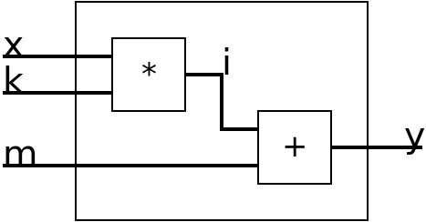

wireblocks
=====

Discrete Event Simulator Framework.

Build
-----

    $ rebar3 compile

Getting Started
---------------

The goal of this guide is to illustrate how to build a linear block
out of one multiplier block and one adder block.

The first thing we need in a supervisor.
It will keep track of our Wires.
Create the supervisor:

	{ok, Supervisor} = wireblocks_sup:start_link().

After we have created / stared our supervisor we create three wires for the multiplier block.
It is key to create both the two input wires and the output wire directly:

    {ok, X} = wire:start(Supervisor, [x, 0]),
    {ok, K} = wire:start(Supervisor, [k, 0]),
    {ok, I} = wire:start(Supervisor, [i, 0]),

We then create the block:

    {ok, Mul} = mul:start(my_mul1, x, k, i),

Before we introduce the adder block we need to create two new wires.

    {ok, M} = wire:start(Supervisor, [m, 0]),
    {ok, Y} = wire:start(Supervisor, [y, 0]),

These will act as one input and one output.
Let's add the adder block:

    {ok, Adder} = adder:start(my_adder1, m, i, y),
